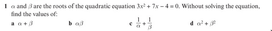
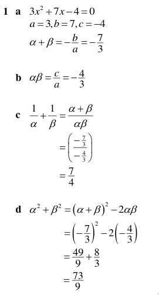
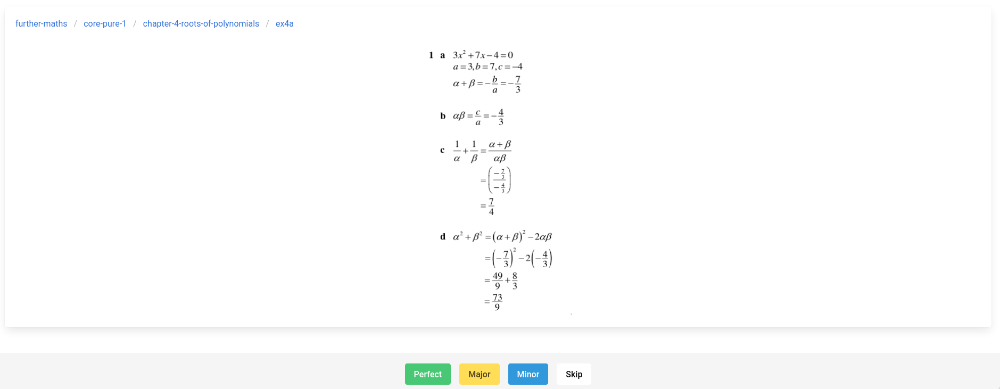
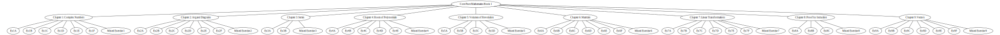

## Sergeant
Sergeant is a tool for practicing the application of knowledge, as a supplement to existing tools for practicing recall such as Anki or Mnemosyne.

---
> __NOTICE__: This is very much a work in progress. This won't work out of the box at all.
---

- [Sergeant](#sergeant)
- [> __NOTICE__: This is very much a work in progress. This won't work out of the box at all.](#-notice-this-is-very-much-a-work-in-progress-this-wont-work-out-of-the-box-at-all)
  - [Why](#why)
    - [Why Not Just Use Anki?](#why-not-just-use-anki)
    - [Why Not Just Use The Exercises In The Textbook?](#why-not-just-use-the-exercises-in-the-textbook)
    - [Previous Solution](#previous-solution)
  - [Usage](#usage)
    - [Adding Questions](#adding-questions)
  - [Structure](#structure)
    - [Types](#types)
      - [Cards](#cards)
      - [Sets](#sets)
        - [Example 1: Series Revision](#example-1-series-revision)
        - [Example 2: Staggered Review](#example-2-staggered-review)
        - [Example 3: Exam Questions](#example-3-exam-questions)
      - [Views](#views)
      - [Config](#config)
    - [API](#api)

### Why
Spaced repetition is [really](http://cognitivemedium.com/srs-mathematics), [really](http://augmentingcognition.com/ltm.html), [really](https://www.gwern.net/Spaced-repetition), [really](https://notes.andymatuschak.org/Spaced_repetition_memory_systems_make_memory_a_choice) good for recall. By design, it doesn't really allow you to forget any information that you attempt to learn.

However, in my use-case as an A-level student<sup id="a-subjects">[1](#f-subjects)</sup>, I feel spaced repetition alone leaves something missing because it doesn't allow you to practice the application of the knowledge you remember. This is not a critique of spaced repetition programs like Anki -- it's not what they're designed for.

#### Why Not Just Use Anki?
One of the reasons that I love Anki is that it's about doing something everyday rather than cramming it all at the end. What I feel like I'm missing is a tool that has a similar interface and mentality to Anki, but is for practicing actual problems rather than improving recall alone.

I don't think it would make sense to just add questions and their answers to Anki for a few reasons:

1. Anki flashcards should fit in working memory. Non-recall problems often require more than just working memory -- I don't want to have to switch between doing my normal reviews and then grabbing some pen and paper to work something out, it would be better to keep them seperate.
2. Anki doesn't let your forget. This is great for remembering stuff, but you don't want to remember the answers to a question. Instead, you want to remember the process of getting there in a way that allows you to apply it to other problems.
3. Anki stores everything as a list, not a hierachy. Although you can have subdecks, Anki's scheduler won't understand that consistingly getting questions wrong in one subdeck means it should increase the priority of other questions in the same subdeck. (I don't think.)

But the downside here is that these problems (problems with using it in this particular way, not problems with the software as a whole) are what make Anki so good. It doesn't make sense to use spaced repetition, so you don't get the benefits of spaced repetition.

#### Why Not Just Use The Exercises In The Textbook?
For the same reason that you don't use actual flashcards for Anki -- it's just a lot more convient.

The questions come from the textbook anyway, the difference is just in the way they're presented. A screenshot of the question followed by the screenshot of the answer (or better, the worked solution) means that the feedback loop is tighter. Instead of doing a bunch of questions and then looking the answers up, it's easier to see where you went wrong.

Moreover, it's more _fun_. As unbelievable as it sounds, writing a new piece of software means that you can get stuff like streaks and fun sound effects that release all that lovely dopamine when you get something right instead of the hassle of flicking to the back pages.

#### Previous Solution
In order to get around this problem, I have previously made _a lot_ of small cards which tackle different parts of the general process around a particular type of question. These look something like this:

```
(Further Maths - Partial Fractions)

Q:     A             B              C
    --------  +  ----------  +  --------- 
    (ax + b) +   (cx + d)^2     (cx + d)

   What does this look like as one fraction??


A: A(cx + d)^2 + B(ax + b) + C(ax + b)(cx + d)
   -------------------------------------------
            (ax + b)(cx + d)^2
```

(in reality I use MathJax and not plain text formatting).

In combination with about 10 other similar cards, this kind of cements the process so if it comes up in an exam, the hope is that I'll vaguelly know what to do.

Sometimes I also write cards like this:

```
(Further Maths - Vector Equation of a Line)

Q: What is the 5 step process for finding the distance between two parallel lines with direction vector $\pmb{b}$ and general points $A$ and $B$??

A: 1. Make direction vectors the same.
   2. Find an expression for $\overrightarrow{AB}$.
   3. Make an equation by setting $\overrightarrow{AB} \cdot \pmb{b} = 0$.
   4. Substitute solution back into $\overrightarrow{AB}$ in order to get the direction vector between the two points.
   5. Use Pythagoras to work out the length of the line.
```

But this has its problems too.

They're both somewhat useful, but I would hardly expect myself to get a question correct based on just flashcards like that alone.

As one more example, I have loads of flashcards in Anki about what the determinant of a matrix is -- though I tried a question recently about finding it, I got the order of multiplication wrong. I knew the general process but hadn't practiced the specifics enough.

So I need to routinely practice questions on top of using Anki so don't make mistakes. But I'm lazy. I don't want to have to pick and choose my own questions every day and keep track of what I'm not doing too well at.

### Usage
```sh
$ sergeant
# Starts a server on localhost:8080 and opens it in the browser.
```

#### Adding Questions
This is the ugly bit.

You need to take a lot of screenshots. It's hard to find databases of questions<sup id="a-question-database">[?](#f-question-database)</sup> that are exactly tailored to the courses you're doing and in a format that could easily be added to the program.

Furthermore, most questions aren't in the public domain, plus the ones that are pretty much predate colour TV and ask questions about the most effective arrangements of horses for combat. This means it's hard to share questions between people that are doing the same course -- it's a big no fun zone.

To add questions, you can either do it through the web UI or through the command line:

```sh
$ sergeant add --path 'further-maths/core-pure-1/chapter-1-complex-numbers/ex1a' --question "question.png" --answer "answer.png"
```

But adding more than a few at a time this way is long-winded and painful. The following command listens lets you take screenshots and automatically put them in the right place.

```sh
$ sergeant screenshot --path 'further-maths/core-pure-1/chapter-1-complex-numbers/ex1a'
# Listens for keyboard "Q" (question), "A" (answer), "D" (done) and "C" (cancel).
```

Sometimes a question will span a page break. To solve this, the `screenshot` command lets you append multiple photographs together by pressing `Q` again. For more information, see:

```
$ sergeant screenshot --help
```

Here's an example of a question and answer pair, ready to be used by the program:




If these images were in the home directory and were called `question.png` and `answer.png` respectively, the command to add them to the path `further-maths/core-pure-1/chapter-1-complex-numbers/ex1a` would be: 

```sh
$ sergeant add --path 'further-maths/core-pure-1/chapter-1-complex-numbers/ex1a' --question "question.png" --answer "answer.png"
```

Notice how it's not a seperate question-answer pair for parts `a`, `b`, `c` and `d` since it's difficult to remove the surrounding context.

### Structure
#### Types
##### Cards



A card is the basic unit of the program, consisting of an image of a question and an image of an answer. These images can come from anywhere:

- Screenshots of textbook exercises
- Exam questions
- Pictures of homework

Like in Anki, each card should be self-contained so that it is answerable without any context. However, they shouldn't be easy questions that you can do in your head -- you're supposed to do cards from Sergeant with pen and paper.

When you answer the question on a card, there are four possible outcomes:

- **Perfect**: The question was answered flawlessly.
- **Major**: You couldn't answer the question or misunderstood it to the point of it not being correct at all.
- **Minor**: You made a small mistake which meant that the answer wasn't quite right, such as forgetting one last step or using the wrong units.
- **Skip**: This moves on to the next card like this card was never seen.

Each outcome has a consequence:

- **Perfect**: The question won't turn up again unless viewing "random" cards.
- **Minor**: The question also won't turn up again unless viewing "random" cards. _Some other change needs to happen too -- questions from a path that are consistently marked 'minor' still need taking care of._
- **Major**: The question will be added to a "review queue" which allows you to go back and see what kind of mistakes you've made so you can make notes or adjust your technique accordingly. The question will also turn up when doing viewing "balanced" cards.
- **Skip**: The question can come up again in any way.

Cards are stored in `~/.local/share/sergeant/cards`, a directory following the [Albatross Format](https://github.com/albatross-org/specs/blob/master/specs/format.md).

Each card is an entry that looks like this:

```yaml
---
title: "Question <random 16-character string>"
date: "2021-02-19 12:32"
type: "question"
tags: ["@?any-tags"]
completions:
    perfect:
        - date: 2021-02-16 10:18
          time: 7m10s
    minor:
        - date: 2021-02-16 10:18
          time: 5m51s
    major:
        - date: 2021-02-16 10:18
          time: 5m53s
        - date: 2021-02-16 10:18
          time: 5m53s
---

Any additional notes about the card, optional. For example:
Didn't realise that the partial fractions added up along the diagonal.
```

Each card has two attachments:

- `question.png`
- `answer.png`

The path of the card is used to organise it. An example of a directory strucutre would be:

```
entries
├── further-maths
│   ├── edexcel-core-pure-1
│   │   └── chapter-4
│   │       └── ex4a
│   │           ├── question-0NiDQqGdzxTSipJa
│   │           ├── question-81EM6cpM3ANxcQZB
│   │           ├── question-jDxorrl9shZviWeW
│   │           └── question-SYXM6N9kYAUtCRSk
│   └── edexcel-core-pure-2
│       └── chapter-2
│           └── ex2a
│               └── question-CmFQa4Ja5mO5ppLh
└── maths
    └── edexcel-pure-1
        └── chapter-12
            └── ex12k
                ├── question-brPIwCwyyi7XjbWD
                ├── question-VTVHMfyekhxOVtIU
                ├── question-W4pZGfSQ2FX9jpVq
                ├── question-X7ooEt4QJnxa8nbF
                ├── question-XpY5m32k5LdbGhrF
                └── question-ZIlsykvSk3ZcyNDv

```

Using the filesystem here is good because it provides a hierachy:

- `.` (the root): Every topic, so every card added to the program.
- `maths`: The Maths topic as a whole.
- `further-maths`: The Further Maths topic as a whole.
- `further-maths/edexcel-core-pure-1`: All questions in the first Further Maths textbook.

For most resources, such as a textbook, they naturally divide themselves quite nicely into a tree:



##### Sets
Sets are a collection of cards. Some are predefined, such as:

- `all`: A set containing all cards added to the program.

Named custom sets can be created [in the config](#config) or used on the fly. This allows you to target revision for specific topics.

###### Example 1: Series Revision
You might want to make a set called `series-may-2021` for a test on mathematical series that's coming up soon. This would involve getting the cards from a couple of different paths and also filtering for cards that are hard:

```yaml
- series-may-2020:
    - name: Series Revision
    - description: "This set contains revision materials for the May 2021 series exam."
    - paths:
        - further-maths/core-pure-1/chapter-3-series
        - further-maths/core-pure-1/chapter-8-proof-by-induction
        - further-maths/core-pure-2/chapter-2-the-method-of-differences
    - tags:
        - '@?hard'
```

###### Example 2: Staggered Review
You might also only want to study for topics that you added between 3 months and 1 month ago. To do this, you could define a set like:

```yaml
- three-month-rolling:
    - name: Three Month Rolling
    - description: "This set contains all questions added to the program between 90 and 30 days ago."
    - before-duration: 90 days
    - after-duration: 30 days
```

###### Example 3: Exam Questions
As one final example, instead of practicing questions from a textbook, you may want to practice only questions from past exam questions:

```yaml
- exam-questions:
    - name: Exam Questions
    - description: "This set contains exam questions."
    - paths:
        - maths/exams
        - physics/exams
        - computing/exams
        - further-maths/exams
```

##### Views
Sets can be viewed in different ways. A *view* is a certain way that a series of cards will appear:

- **Balanced** *(default)*: Cards unseen before or marked as major or minor mistakes can appear (though minor cards will come up less often).
- **Random**: Any card can come up in any order.
- **Unseen**: Cards that haven't been seen before (except from those *skip*ed) can be seen.
- **Difficulties**: Cards marked as major or minor mistakes will appear, and cards from categories who's question are consistely marked as majorly or minorly wrong will be more likely.

##### Config
All config is stored in `~/.config/sergeant/config.yaml`. Eventually, it won't be neccessary to update this config file manually since all options should be able to be managed using the web UI. The format looks like this:

```yaml
names:
    - further-maths: "Further Maths"
    - further-maths/core-pure-1: "Core Mathematics Pure 1"

sets:
    - revision-may-2020:
        - paths:
            - further-maths/core-pure-1/chapter-3-series
            - further-maths/core-pure-1/chapter-8-proof-by-induction
            - further-maths/core-pure-2/chapter-2-the-method-of-differences
        - tags:
            - '@?hard'

    # ...
```

#### API
* `/cards`
  * Contains methods for managing cards.
  * **PUT** `/update`
    * `?id`
    * `?answer`
    * `?time`
* `/sets`
  * Contains methods for viewing and updating sets.
  * GET `/get`
    * Gets a new card according the view specified.
    * `?setName`
    * `?viewName`
  * GET `/stats`
    * Gets stats about a particular set.
    * `?setName`
  * GET `/list`
    * Gets a list of all available sets.

---

<b id="f-subjects">Subjects</b> I take Maths, Further Maths, Physics and Computer Science. I'm lucky in that these are largely not essay-based subjects, so it's easier to objectively get something right or wrong. It also means the questions are a lot shorter. [↩](#a-subjects)

<b id="f-question-database">Examples</b>: Services like [Exampro](https://www.exampro.co.uk/) exist for this purpose, though they aren't aimed at students and are instead of teachers looking to create assesments from stiching old questions together. [↩](#a-question-database)